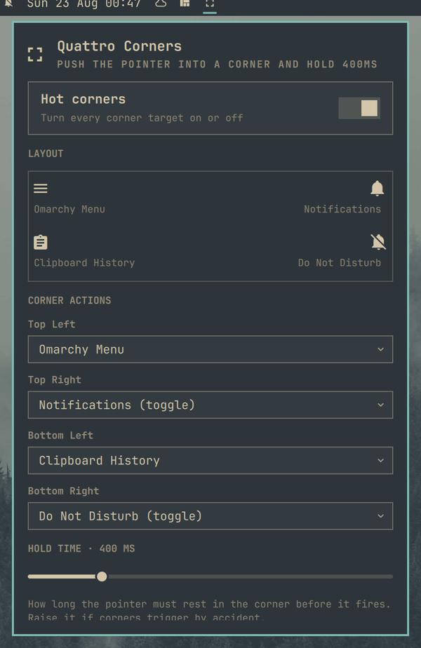

# Quattro Corners

macOS-style hot corners for Omarchy. Push the pointer into a screen corner, hold briefly, and the action assigned to that corner fires.



## What it does

- Assigns an independent action to each of the four screen corners, on every monitor
- Ships with useful defaults instead of placeholders:
  - top-left — Omarchy Menu
  - top-right — Notifications (toggle)
  - bottom-left — Clipboard History
  - bottom-right — Do Not Disturb (toggle)
- Shows a miniature of the screen in the panel so all four assignments read at a glance
- Adjustable hold time and corner size, so corners stop firing by accident
- A master on/off switch for all corners

## Actions

| Action | What happens |
|---|---|
| Omarchy Menu | Opens the Omarchy menu |
| Notifications (toggle) | Replays notification history; hitting the corner again dismisses it |
| Do Not Disturb (toggle) | Turns notification silencing on and off |
| Clipboard History | Opens the clipboard picker |
| Emoji Picker | Opens the emoji picker |
| Lock Screen | Locks the session |
| Turn Display Off | Blanks the displays (`hyprctl dispatch dpms off`) |
| Custom Command… | Runs any shell command you type into the panel |
| Nothing | Leaves that corner inert |

Pick **Custom Command…** for a corner and a text field appears underneath it. Type the command, press Enter or hit Save, and that corner runs it.

## Requirements

- Omarchy 4 / Quickshell plugin support
- Hyprland (only for the "Turn Display Off" action)

## Configuration

Everything is set from the panel. The stored shape is:

```json
{
  "id": "andreconde.quattro-corners",
  "enabled": true,
  "dwellMs": 400,
  "targetSize": 24,
  "topLeftAction": "menu",
  "topRightAction": "notifications",
  "bottomLeftAction": "clipboard",
  "bottomRightAction": "dnd",
  "topLeftCommand": ""
}
```

- `dwellMs` — how long the pointer must rest in the corner before it fires. Raise it if corners trigger by accident.
- `targetSize` — the size in pixels of the corner hit area.

## Notes

- A corner fires once per entry. Resting in the corner does not repeat it; leaving and returning re-arms it.
- The plugin ships both a service (the corner targets) and a bar widget (the configuration panel). The service reads its settings straight from `shell.json`, so changes made in the panel apply without restarting the shell.

## Install

```bash
omarchy plugin add <repo-url> --enable --yes
```
